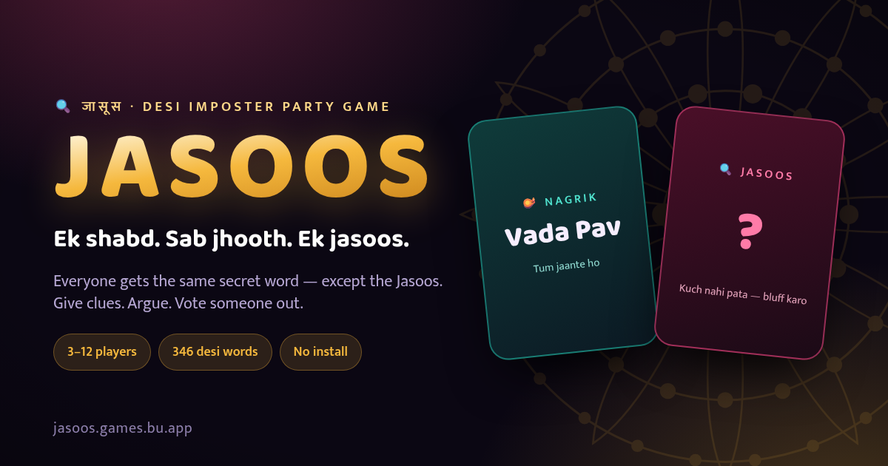

# 🕵️ JASOOS — Indian Imposter Party Game (जासूस)

> **"Ek shabd. Sab jhooth. Ek Jasoos."**  
> *One secret word. Everyone bluffing. One Imposter in the room.*

India's premier desi social deduction party game designed for **3 to 12 players**. Inspired by games like Spyfall and Undercover, customized with 1500+ Indian culture words, Bollywood trivia, street food, cricket legends, and desi nuances.



---

## 🎮 Features

- 🎭 **Three Game Modes**:
  - **Pass & Play (Offline)**: Play on a single smartphone passed around the room with zero internet required.
  - **Solo vs AI Bots**: Practice solo against intelligent simulated desi personas.
  - **Online Rooms**: Real-time room-code multiplayer (`ABCD`) connecting friends on their own phones.
- 🇮🇳 **1500+ Authentic Indian Words across 30+ Categories**:
  - Bollywood blockbusters, Street Food, Mithai, Cricket, Desi Relatives, Shaadi moments, Jugaad, Chai Tapri, Indian TV serials, and more!
- 🌐 **3 Language Options**:
  - Hinglish (default)
  - Pure Hindi (हिंदी)
  - English
- ⚡ **Instant PWA (Progressive Web App)**:
  - Install to home screen on iOS & Android.
  - Fully functional offline for Pass & Play.
- 🔊 **Rich Audio & Haptics**: Custom synthesized Web Audio sound effects, ambient timers, and particle confetti.

---

## 🚀 Quick Start (Local Development)

### 1. Clone & Install
```bash
git clone https://github.com/Ansh-Yadav-maths-lover/jasoos.git
cd jasoos
npm install
```

### 2. Start the Live Server
```bash
npm start
```
Open **[http://localhost:3000](http://localhost:3000)** in your browser or test with friends on the same local network!

### 3. Build the Bundle
If you edit files in `jasoos/src/`, re-bundle with:
```bash
npm run build
```
This builds the self-contained `index.html` and `outputs/` assets in milliseconds.

---

## ☁️ Deploying to Vercel

JASOOS is optimized for 1-click deployment on **[Vercel](https://vercel.com)**.

### Step 1: Import Project
1. Push this repository to your GitHub account.
2. Visit **[vercel.com/new](https://vercel.com/new)**.
3. Select your `jasoos` repository.

### Step 2: Configure & Deploy
- **Framework Preset**: Other (Static)
- **Root Directory**: `./`
- **Build Command**: `npm run build`
- **Output Directory**: Leave blank or set to `./`
- Click **Deploy**!

> **Online Multiplayer Rooms on Vercel**:  
> Online Rooms work **100% out-of-the-box on Vercel with zero configuration required**! The game automatically switches to serverless WebRTC P2P signaling (powered by PeerJS Cloud and STUN/TURN relays) when hosted on Vercel or any static platform.  
> You can also connect to a dedicated custom WebSocket server (like Render, Railway, or VPS) anytime via the in-game Settings menu (`⚡ Online Server`) or `window.JASOOS_WS_URL`.

---

## 📂 Project Structure

```
├── build.js             # Fast Node.js bundler
├── server.js            # Node.js HTTP & WebSocket room relay server
├── vercel.json          # Vercel caching & service worker routing config
├── index.html           # Production-ready single-file game bundle
├── outputs/             # Build output bundle, icons, manifest, and audio/fonts
│   ├── index.html
│   ├── jasoos.html
│   ├── manifest.webmanifest
│   ├── sw.js
│   └── baloo.woff2
├── jasoos/
│   ├── src/             # Modular source chunks (HTML, CSS, JS)
│   │   ├── 00_head.html
│   │   ├── 01_css_base.css
│   │   ├── 10_i18n.js
│   │   ├── 20_words_*.js # Indian word banks & categories
│   │   ├── 30_core.js   # Game logic & state machine
│   │   ├── 40_ui.js     # Screen renderers & user interactions
│   │   └── 50_net.js    # WebSocket multiplayer synchronization
│   └── assets/          # PWA icons, web manifest & fonts
└── package.json         # Project metadata and npm scripts
```

---

## 📜 How to Play (Rules)

1. **Role Reveal**: Everyone sees the secret word (e.g. *Biryani*). The **Jasoos** only sees "YOU ARE THE JASOOS" with no word!
2. **Clue Round**: In turns, each player gives a **single 1-word or short clue** related to the topic without giving the secret away.
3. **Imposter Bluff**: The Jasoos must pretend they know the word and blend in!
4. **Discussion & Voting**: Players argue, debate, and vote on who the Jasoos is.
5. **Endgame**:
   - If citizens vote out the Jasoos: The Jasoos gets **one final guess** at the secret word. If correct, the Jasoos steals the win!
   - If citizens eliminate an innocent citizen: The Jasoos wins!

---

## 🛡️ License

MIT License. Free for personal, non-commercial, and party entertainment. Built with ❤️ for desi gaming nights.
